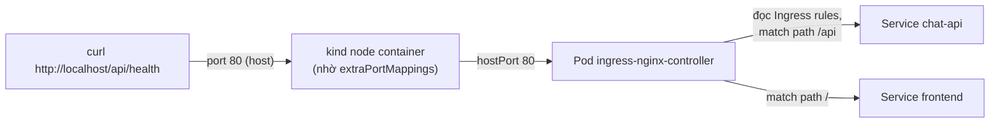
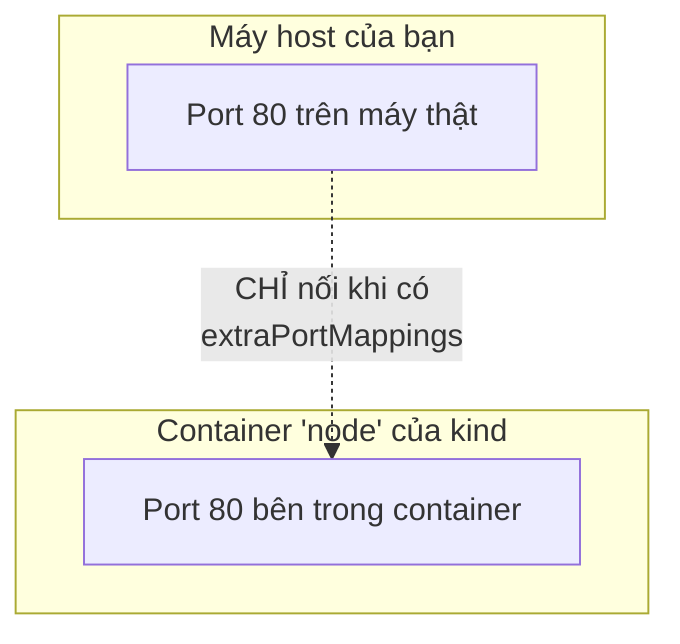
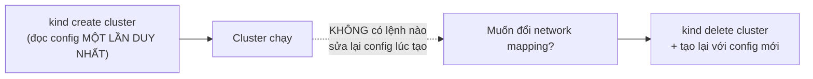
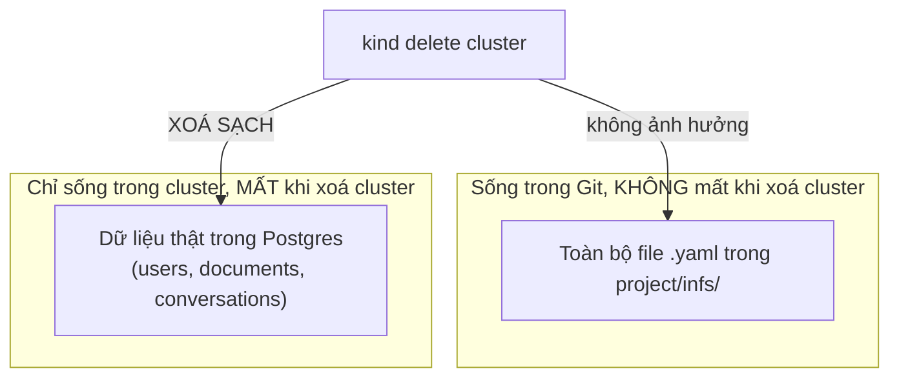

# Chương 21 — Xây lại từ đầu: Ghi chú kiến thức

> Đọc truyện trước: [Chương 21 — Xây lại từ đầu](../../handbook/vi/part-02-first-cluster/ch21-rebuilt-from-scratch.md)

---

## 1. Sơ đồ tổng quan: Ingress đứng ở đâu trong luồng request



**Ba tầng, không phải một:** `Ingress` (object khai luật) → `Ingress Controller` (Pod thật thực thi luật đó) → `Service` (đích cuối cùng nhận traffic). Object `Ingress` tự nó không lắng nghe port nào cả — nó chỉ là dữ liệu cấu hình mà Controller đọc và hành động theo.

> **Note quan trọng:** `backend.service` trong `Ingress` **bắt buộc** phải trỏ vào một Service, không bao giờ trỏ thẳng vào Deployment hay Pod. Đây chính là lý do chương này phải viết thêm Service cho `chat-api` — trước giờ nó chỉ dùng `port-forward` thẳng vào Deployment, chưa từng cần Service, nên khi Ingress cần một cái tên để trỏ tới, chưa có gì tồn tại cả. Thiếu Service, `kubectl get endpoints <tên>` sẽ báo `NotFound`, và Ingress trả về `503 Service Temporarily Unavailable` — không phải lỗi ở Ingress, mà là không có gì cho Ingress trỏ tới.

---

## 2. Vì sao `kind` cần `extraPortMappings` — điều Service/Ingress không tự giải quyết được



`kind` là một container Docker đóng vai trò node — về bản chất, port bên trong container đó KHÔNG tự động lộ ra máy host, giống hệt nguyên lý `docker run` cần `-p` để map port. `extraPortMappings` trong config `kind` chính là tương đương của `-p 80:80` cho container node đó. Ingress Controller có cấu hình đúng cỡ nào, nếu port 80 của container node chưa được map ra host, máy host vẫn không gọi vào được.

> **Note:** đây là gotcha riêng của `kind`/local dev — trên cloud thật (EKS/GKE/AKS), Ingress Controller thường đi kèm một Service kiểu `LoadBalancer`, cloud provider tự cấp một IP công khai thật, không cần khái niệm "map port ra host" như trên máy cá nhân.

---

## 3. Vì sao phải xoá cả cluster — không có cách nào "thêm" config sau



Khác với hầu hết resource trong Kubernetes (sửa YAML rồi `apply` lại là xong), cấu hình **lúc tạo** một cluster `kind` (network mapping, số node...) chỉ được đọc đúng một lần. Đây không phải giới hạn của Kubernetes nói chung — là đặc thù của việc `kind` mô phỏng cluster bằng container Docker, và Docker container cũng không "thêm port mapping" vào một container đang chạy được (phải tạo container mới).

---

## 4. Cấu hình (declarative) sống sót, dữ liệu (state) thì không — ranh giới quan trọng nhất chương



| | Sống sót qua việc xoá cluster? | Vì sao |
|---|---|---|
| File YAML (`project/infs/*.yaml`) | Có | Nằm trên đĩa máy bạn / Git, hoàn toàn độc lập với cluster |
| Object trong cluster (Pod, Service, Deployment...) | Không, nhưng tái tạo được ngay lập tức | Chỉ cần `kubectl apply -f` lại đúng file đã có |
| Dữ liệu bên trong PVC (hàng dữ liệu Postgres) | Không, và KHÔNG tự tái tạo được | Không có object YAML nào mô tả "nội dung" một hàng dữ liệu — chỉ mô tả cấu trúc/schema |

> **Note — đây chính là lý do "declarative" (Chương 5) mạnh tới mức nào:** biết trước dữ liệu KHÔNG nằm trong YAML, nên phải tự tay `pg_dump` sao lưu trước khi làm bất cứ điều gì có thể xoá cluster. Không phải Kubernetes tự nhắc bạn — đây là kỷ luật vận hành, không phải tính năng.

---

## 5. `pathType: Prefix` và thứ tự match trong Ingress

```yaml
rules:
  - http:
      paths:
        - path: /api
          pathType: Prefix
          ...
        - path: /
          pathType: Prefix
          ...
```

| `pathType` | Ý nghĩa |
|---|---|
| `Exact` | Phải khớp chính xác từng ký tự đường dẫn |
| `Prefix` | Khớp nếu request bắt đầu bằng đúng chuỗi này (theo từng đoạn `/`, không phải khớp ký tự thô) |
| `ImplementationSpecific` | Tuỳ Ingress Controller tự diễn giải (không khuyến khích dùng nếu không thật sự cần) |

> **Note:** `Ingress` chuyển nguyên **path gốc** của request tới backend, không tự động cắt bớt phần đã khớp (trừ khi chủ động cấu hình `rewrite-target`). Route `/health` của `chat-api` không hề mang tiền tố `/api`, nên phải khai một luật `pathType: Exact` riêng cho đúng path `/health` — gộp nó vào luật `/api` (Prefix) sẽ khiến request `/api/health` được chuyển nguyên văn `/api/health` tới app, trong khi app chỉ biết mỗi `/health`, dẫn tới `404` dù Service/Endpoints hoàn toàn khoẻ mạnh.

> **Note:** với `ingress-nginx`, khi nhiều luật `Prefix` cùng khớp một request, luật có đường dẫn **dài hơn/cụ thể hơn** luôn được ưu tiên — không phụ thuộc thứ tự viết trong file. Viết `/api` trước `/` chỉ để dễ đọc cho người, không phải yêu cầu bắt buộc về mặt kỹ thuật.

---

## 6. Bài tập tự luyện

**Câu hỏi khái niệm:**

1. Nếu xoá `Ingress` object (không xoá Ingress Controller) — `chat-api`/`frontend` có còn hoạt động bên trong cluster không? Còn gọi được từ `http://localhost/` không?
2. Backup `pg_dump` chỉ nên chạy MỘT LẦN trước khi xoá cluster, hay nên là việc làm định kỳ? Vì sao?
3. `http://localhost/` sau chương này có khác gì về bản chất so với `kubectl port-forward` ở Chương 9? Điểm giống và khác chính xác là gì?

**Thực hành:**

4. Chạy `kubectl get pods -n ingress-nginx` — tìm Pod `ingress-nginx-controller`, xem `kubectl describe pod` của nó có field nào liên quan tới `hostPort` không.
5. Thử xoá file `ingress.yaml` object bằng `kubectl delete -f ingress.yaml`, sau đó `curl http://localhost/api/health` — quan sát lỗi trả về, so sánh với lỗi khi `chat-api` Pod chết hẳn (khác nhau ở tầng nào bị đứt).
6. Tạo thêm một `path: /admin` trỏ tới một Service không tồn tại — apply thử, xem `ingress-nginx` phản ứng ra sao khi backend không có Endpoints nào (gợi ý: thường trả `503`, không phải lỗi lúc `apply`).
