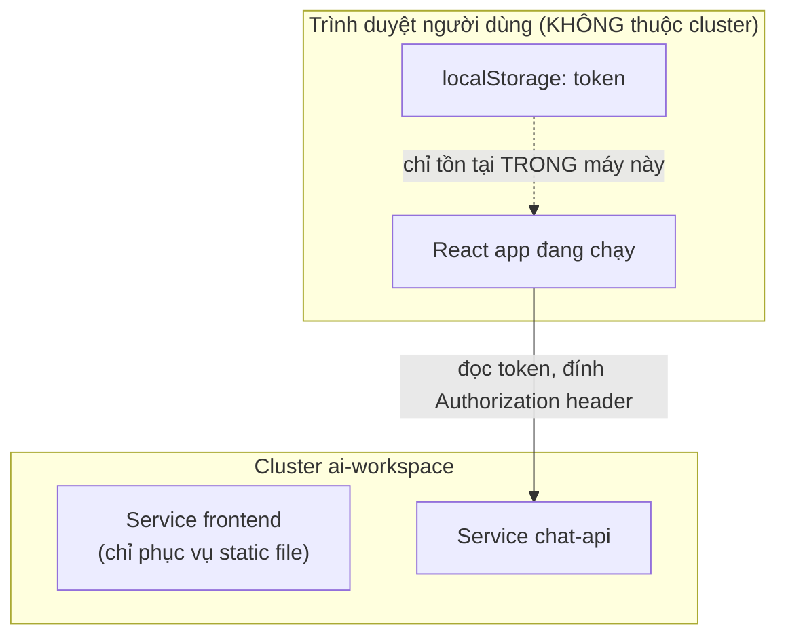
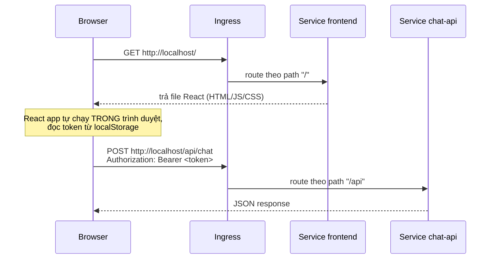
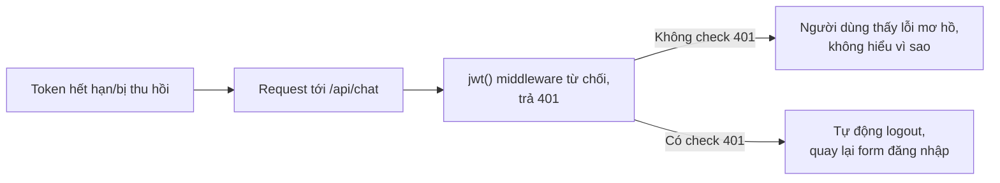

# Chương 22 — Không cần curl nữa: Ghi chú kiến thức

> Đọc truyện trước: [Chương 22 — Không cần curl nữa](../../handbook/vi/part-02-first-cluster/ch22-no-more-curl.md)

Chương này gần như thuần frontend — không có object Kubernetes mới, không file YAML mới. Ghi chú ngắn, tập trung vào đúng một điểm: phân biệt state sống ở đâu, và validate lại toàn bộ đường đi request một lần cuối.

---

## 1. Sơ đồ tổng quan: `localStorage` không nằm ở đâu trong cluster cả

**Điểm cần nhớ:** `localStorage` là bộ nhớ của trình duyệt, không phải của server — `frontend` Pod chỉ có nhiệm vụ trả về file JS/HTML tĩnh **một lần**, sau đó không còn vai trò gì trong việc giữ đăng nhập nữa. Xoá hết Pod `frontend`, tạo lại bao nhiêu lần cũng không ảnh hưởng gì tới việc người dùng đã đăng nhập hay chưa — vì trạng thái đó chưa từng nằm trong cluster.

---

## 2. Đường đi đầy đủ của một request, xác nhận lại lần cuối

Hai request tới CÙNG một `http://localhost/` nhưng đi qua hai luật khác nhau trong `Ingress` (`/` và `/api`) — người dùng không hề biết, và không cần biết, có bao nhiêu tầng đang xử lý phía sau.

---

## 3. Vì sao check `401` ở frontend là bước hợp lý, không phải tuỳ chọn

`chat-api` đã từ chối đúng, đúng thiết kế từ Chương 17 — nhưng nếu frontend không tự diễn giải mã `401` thành hành động cụ thể (đăng xuất), người dùng chỉ thấy một request thất bại không rõ lý do. Backend trả đúng mã lỗi chuẩn, frontend phải chủ động đọc và phản ứng — hai phía cùng cần làm đúng phần việc của mình.

---

## 4. Bài tập tự luyện

**Câu hỏi khái niệm:**

1. Mở hai trình duyệt khác nhau (hoặc một cửa sổ ẩn danh), đăng nhập hai tài khoản khác nhau cùng lúc — có xung đột gì không? Vì sao?
2. Nếu xoá `localStorage` bằng tay (DevTools → Application → Local Storage) trong lúc đang dùng app — chuyện gì xảy ra ở lần gọi API tiếp theo?
3. `frontend` hiện có `replicas: 2` — khi tải trang, request GET đầu tiên có thể rơi vào Pod nào trong hai Pod đó. Việc này có ảnh hưởng gì tới trải nghiệm đăng nhập không? Vì sao (gợi ý: liên hệ mục 1).

**Thực hành:**

4. Mở DevTools (F12) → tab Network, đăng nhập lại từ đầu — xác nhận thấy request `POST /api/auth/login` KHÔNG có header `Authorization` (vì lúc đó chưa có token), còn `POST /api/chat` sau đó THÌ có.
5. Xoá thủ công token trong `localStorage`, reload trang — xác nhận quay lại đúng form đăng nhập, không crash, không màn hình trắng.
6. Deploy một bản `chat-api` với `JWT_SECRET` khác (đổi giá trị trong `chat-api-secret.yaml`) trong khi trình duyệt vẫn đang giữ token cũ — gọi thử một request, xác nhận nhận `401` và tự động bị đăng xuất.
