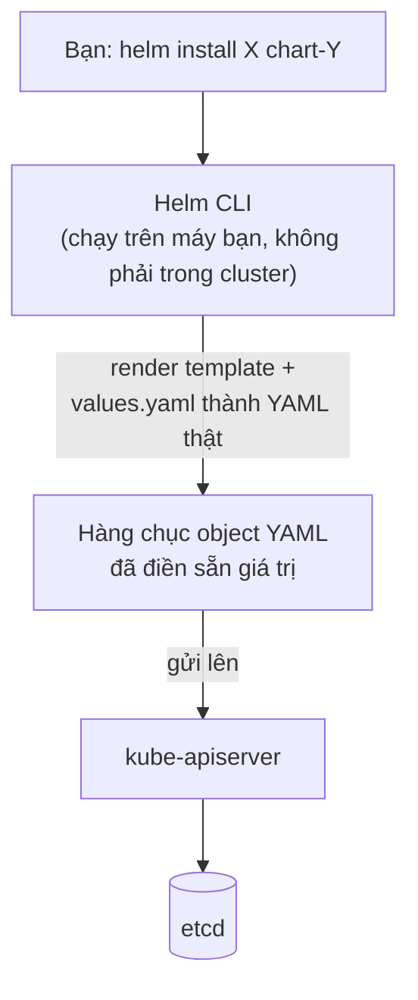
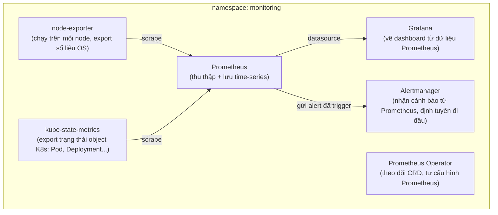

# Chương 24 — Không chỉ là ảnh chụp nữa: Ghi chú kiến thức

> Đọc truyện trước: [Chương 24 — Không chỉ là ảnh chụp nữa](../../handbook/vi/part-03-observability/ch24-no-longer-just-a-snapshot.md)

Chương đầu tiên giới thiệu `Helm` — công cụ khác hẳn mọi thứ dùng tới giờ (toàn `kubectl apply -f`). Ghi chú tập trung vào việc Helm thật sự là gì, và stack Prometheus/Grafana vừa cài gồm những mảnh nào.

---

## 1. Sơ đồ tổng quan: Helm đứng ở tầng nào

**Điểm quan trọng nhất:** Helm không phải một API mới của Kubernetes, không chạy như một Pod đặc biệt có quyền hạn gì khác — nó chỉ là một CLI chạy trên máy bạn (hoặc CI), **sinh ra YAML** từ template + giá trị cấu hình, rồi gửi y hệt như một cú `kubectl apply` khổng lồ. Mọi thứ Helm tạo ra vẫn là Deployment, Service, ConfigMap... bình thường — `kubectl get all -n monitoring` vẫn thấy chúng, sửa/xoá bằng `kubectl` bình thường vẫn được (dù không nên, vì Helm sẽ mất dấu).

---

## 2. `helm repo` — tương tự registry của npm, không phải Docker registry

| Khái niệm | npm | Helm |
|---|---|---|
| Nơi lưu package/chart | npm registry | Helm chart repository |
| Lệnh thêm nguồn | (mặc định 1 registry) | `helm repo add <tên> <url>` |
| Lệnh cài | `npm install <package>` | `helm install <tên-release> <repo>/<chart>` |
| File khai cấu hình | `package.json` | `values.yaml` |
| Bản ghi đã cài gì | `package-lock.json` | `helm list`, `helm history <release>` |

> **Note:** một "Helm chart repository" chỉ là một địa chỉ HTTP tĩnh chứa file index — không phải Docker registry, không liên quan gì tới nơi lưu container image. `prometheus-community/kube-prometheus-stack` là tên chart, không phải tên image.

---

## 3. `kube-prometheus-stack` thật sự cài những gì

| Thành phần | Vai trò |
|---|---|
| Prometheus server | Định kỳ "scrape" (kéo) số liệu từ các nguồn, lưu dạng time-series, có ngôn ngữ truy vấn riêng (PromQL) |
| `node-exporter` | Chạy trên mỗi node (DaemonSet), export số liệu phần cứng/OS (CPU, RAM, disk) |
| `kube-state-metrics` | Export trạng thái các object Kubernetes (bao nhiêu Pod đang Pending, Deployment nào chưa đủ replica...) — khác `node-exporter` ở chỗ đây là số liệu **về Kubernetes**, không phải về máy vật lý |
| Grafana | Chỉ vẽ biểu đồ — tự nó không thu thập gì, luôn cần một datasource (ở đây là Prometheus) |
| Alertmanager | Nhận alert đã được Prometheus đánh giá là "đang xảy ra" (dựa trên rule), quyết định gửi đi đâu (email, Slack...) — chưa cấu hình trong chương này |
| Prometheus Operator | Một controller đặc biệt, theo dõi các CRD (`ServiceMonitor`, `PrometheusRule`) rồi tự viết lại cấu hình cho Prometheus — lý do thêm một target theo dõi mới không cần sửa tay config Prometheus |

---

## 4. So với `metrics-server` (Chương 15) — không thay thế, mà bổ sung

| | `metrics-server` | Prometheus |
|---|---|---|
| Lưu lịch sử? | Không, chỉ số liệu hiện tại | Có, time-series đầy đủ |
| Dùng để làm gì | `kubectl top`, và làm nguồn cho HPA (autoscale) | Dashboard, alert, phân tích xu hướng |
| Có thể gỡ nếu đã có Prometheus? | Không nên — HPA vẫn cần `metrics-server` (hoặc `metrics.k8s.io` API riêng), Prometheus không tự động thay thế API đó | — |

> **Note:** hai hệ thống chạy song song, không loại trừ nhau. `metrics-server` phục vụ đúng một API chuẩn (`metrics.k8s.io`) mà `kubectl top`/HPA cần; Prometheus phục vụ một hệ sinh thái quan sát rộng hơn nhiều, không thay thế vai trò kia.

---

## 5. Bài tập tự luyện

**Câu hỏi khái niệm:**

1. `helm uninstall kube-prometheus-stack -n monitoring` — điều gì xảy ra với các CRD (`ServiceMonitor`, `PrometheusRule`) đã tạo? (gợi ý: Helm có chính sách riêng cho CRD, khác với các resource thường).
2. Nếu tự tay `kubectl edit deployment kube-prometheus-stack-grafana -n monitoring` rồi sửa gì đó, lần `helm upgrade` tiếp theo có giữ lại thay đổi đó không?
3. Vì sao Grafana cần một "datasource" mới vẽ được biểu đồ, trong khi `kubectl top` không cần khái niệm datasource nào cả?

**Thực hành:**

4. Chạy `helm list -n monitoring` — xem cột `REVISION`, thử `helm upgrade` lại với `--set grafana.adminPassword=<mật-khẩu-mới>`, xác nhận `REVISION` tăng lên 2.
5. Chạy `kubectl get crd | grep monitoring.coreos.com` — đếm xem Prometheus Operator đã đăng ký bao nhiêu CRD mới vào cluster.
6. Vào Grafana, tìm dashboard "Kubernetes / Compute Resources / Pod", chọn Pod `postgres` trong namespace `ai-workspace` — so đường `Memory` với con số `resources.limits.memory` đã đặt ở Chương 14, xem có bao giờ chạm ngưỡng chưa.
