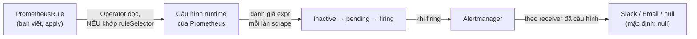
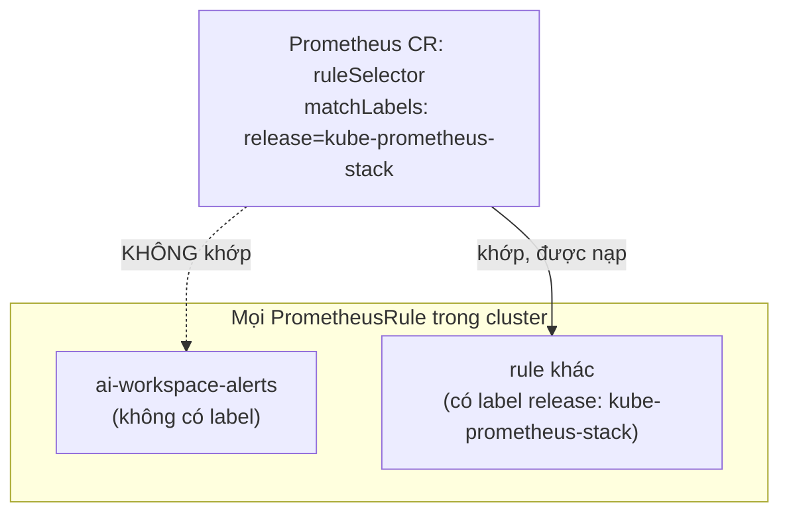

# Chương 25 — Cuối cùng có ai báo: Ghi chú kiến thức

> Đọc truyện trước: [Chương 25 — Cuối cùng có ai báo](../../handbook/vi/part-03-observability/ch25-finally-someone-tells-you.md)

---

## 1. Sơ đồ tổng quan: từ rule tới alert thật, đi qua mấy tầng



**Bốn trạng thái một alert đi qua:** `inactive` (điều kiện chưa đúng) → `pending` (điều kiện vừa đúng, đang chờ đủ thời gian `for:`) → `firing` (đã đúng đủ lâu, coi là thật) → `resolved` (điều kiện hết đúng). Không có bước nào nhảy cóc — kể cả khi điều kiện đúng ngay lập tức, vẫn phải đợi đủ `for:` mới chuyển từ `pending` sang `firing`.

---

## 2. `ruleSelector` — lý do rule "biến mất" dù tạo đúng



Đây chính là cơ chế `matchLabels` đã gặp từ Chương 7 (ReplicaSet chọn Pod) và Chương 8 (Service chọn Pod) — giờ lặp lại một lần nữa, ở một chỗ hoàn toàn khác: Prometheus (qua Operator) chọn `PrometheusRule` theo đúng cách đó, không phải "cứ là CRD đúng loại thì tự động nạp". Nhãn `release: kube-prometheus-stack` không phải quy ước chung của Kubernetes — là quy ước riêng do chart `kube-prometheus-stack` tự đặt ra, đọc được qua `kubectl get prometheus -n monitoring -o yaml`, tìm field `spec.ruleSelector`.

> **Note:** đây là lý do nên luôn kiểm tra `ruleSelector`/`serviceMonitorSelector` của Prometheus CR khi rule/target "biến mất" không rõ lý do — gần như luôn luôn là vấn đề nhãn, không phải cú pháp YAML sai.

---

## 3. `for:` — vì sao không alert ngay khi điều kiện vừa đúng

```yaml
expr: increase(...) > 3
for: 1m
```

`for: 1m` nghĩa là: điều kiện `expr` phải liên tục đúng trong ít nhất 1 phút mới chuyển sang `firing`. Không có `for:`, alert sẽ nhảy thẳng `inactive → firing` ngay khi điều kiện đúng một lần duy nhất — dễ gây "báo động giả" nếu chỉ là một đợt tăng đột biến thoáng qua rồi tự hết. `for: 1m` trong chương này để test nhanh; production thật thường dùng `for: 5m` hoặc lâu hơn, đánh đổi giữa phát hiện sớm và tránh làm phiền vì nhiễu.

---

## 4. Alertmanager với receiver `null` — vẫn có giá trị, dù chưa gửi đi đâu

| Trạng thái | Có ích gì |
|---|---|
| Alert firing, receiver `null` | Xem được trong Alertmanager UI, xác nhận pipeline hoạt động đúng — vẫn hữu ích để test |
| Alert firing, receiver Slack/email thật | Chủ động được báo, không cần tự mở dashboard lên kiểm tra |

> **Note:** thiếu webhook/credentials thật không có nghĩa là bước này vô nghĩa — tách riêng "alert có kích hoạt đúng không" (đã kiểm chứng bằng CrashLoopBackOff cố ý) khỏi "alert có gửi đi đúng kênh không" (chưa kiểm chứng, cần hạ tầng bên ngoài) giúp biết chính xác phần nào đã chắc chắn, phần nào còn phụ thuộc yếu tố bên ngoài chưa có.

---

## 5. Bài tập tự luyện

**Câu hỏi khái niệm:**

1. Nếu đổi `for: 1m` thành `for: 0m` (hoặc bỏ hẳn `for:`), alert sẽ nhạy hơn hay ít nhạy hơn với nhiễu ngắn hạn? Đánh đổi là gì?
2. Rule đang lọc theo `namespace="ai-workspace"` — nếu Pod trong `kube-system` bị crash loop, alert này có bắt được không? Vì sao?
3. Xoá object `PrometheusRule` sau khi alert đang `firing` — alert có tự động chuyển `resolved` trên Alertmanager không, hay biến mất luôn?

**Thực hành:**

4. Chạy `kubectl get prometheus -n monitoring -o yaml | grep -A5 ruleSelector` — xác nhận đúng nhãn `release` mà Prometheus CR đang yêu cầu trên cluster của bạn.
5. Viết thêm một `PrometheusRule` thứ hai, cảnh báo khi memory một Pod vượt 80% `limits.memory` (gợi ý: dùng metric `container_memory_working_set_bytes` chia cho `kube_pod_container_resource_limits`), nhớ thêm đúng label `release`.
6. Vào Alertmanager UI, tìm mục "Status" — xem toàn bộ cấu hình receiver/route hiện tại, xác nhận đúng route mặc định đang trỏ vào `null`.
