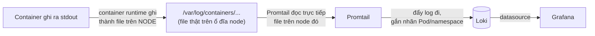
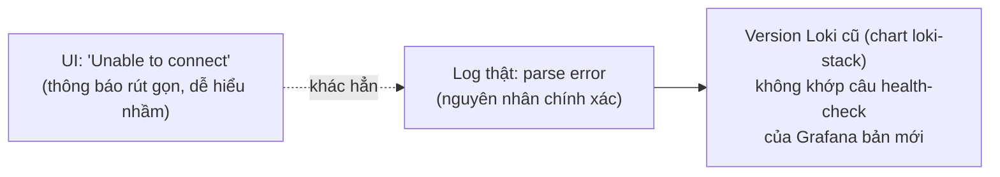

# Chương 26 — Nhật ký sống lâu hơn Pod: Ghi chú kiến thức

> Đọc truyện trước: [Chương 26 — Nhật ký sống lâu hơn Pod](../../handbook/vi/part-03-observability/ch26-the-log-outlives-the-pod.md)

---

## 1. Sơ đồ tổng quan: log đi từ container tới Grafana bằng đường nào



**Điểm khác biệt với `kubectl logs`:** `kubectl logs` đi qua API server, hỏi thẳng kubelet trên node đang chạy Pod đó để lấy log **hiện tại**. `Promtail` không qua API server — nó đọc trực tiếp file log trên đĩa node, đúng lý do nó phải chạy dạng `DaemonSet` (một bản trên mỗi node) thay vì một bản duy nhất.

---

## 2. `DaemonSet` — tầng thứ tư trong họ "quản lý Pod", sau Pod/ReplicaSet/Deployment

| | Pod trần | ReplicaSet/Deployment | DaemonSet |
|---|---|---|---|
| Số lượng | 1, không ai đảm bảo tồn tại | Đúng N, khai qua `replicas` | Đúng 1 trên **mỗi node**, không khai số lượng |
| Thêm node mới | Không liên quan | Không tự thêm Pod | Tự động có thêm 1 Pod trên node mới |
| Ví dụ đã gặp | `chat-api-pod.yaml` (Chương 6) | `chat-api` (Chương 7) | `kube-proxy`, `node-exporter`, `promtail` |
| Dùng khi nào | Gần như không bao giờ (luôn nên có ReplicaSet đứng sau) | App thường, cần scale ngang | Cần đúng một agent chạy trên MỌI máy — log, network, giám sát phần cứng |

> **Note:** `DaemonSet` không có field `replicas` trong `spec` — vì con số đó không do người viết YAML quyết định, mà bằng đúng số node hiện có trong cluster tại mọi thời điểm.

---

## 3. LogQL không phải PromQL, dù trông quen

```
{namespace="ai-workspace", app="chat-api"} |= "error"
```

| Phần | Ý nghĩa |
|---|---|
| `{namespace="ai-workspace", app="chat-api"}` | Chọn **stream** log nào (theo nhãn, y hệt cách PromQL chọn metric) — chưa lọc nội dung |
| `\|= "error"` | Lọc tiếp theo **nội dung dòng log**, kiểu tìm kiếm chuỗi (log filter, không phải label matcher) |

Khác biệt cốt lõi với PromQL: Prometheus lưu **số**, LogQL trước tiên chọn đúng dòng log theo nhãn (nhanh, có index), rồi mới lọc theo nội dung text (chậm hơn, phải đọc từng dòng) — nên luôn chọn nhãn thu hẹp trước, chuỗi tìm kiếm sau, không phải ngược lại.

---

## 4. Vì sao `helm install ... --set grafana.enabled=false`

Chart `loki-stack` mặc định tự cài kèm một bản Grafana riêng, độc lập với bản đã cài ở Chương 24. Không tắt cờ này sẽ có hai Grafana Deployment khác nhau trong cùng namespace `monitoring`, không ai biết cái nào là "chính". `--set` ghi đè giá trị mặc định trong `values.yaml` của chart ngay trên dòng lệnh, không cần tải file `values.yaml` về sửa tay.

> **Note — cái giá của việc tắt `grafana.enabled`:** cơ chế "tự động thêm datasource Loki" của chart này chỉ hoạt động cho đúng Grafana con nó tự cài kèm — tắt Grafana đó thì tắt luôn cơ chế provisioning đi theo, không có gì tự nối sang một Grafana cài từ Helm release khác (kể cả cùng namespace). Hai Helm release là hai đơn vị hoàn toàn độc lập, Helm không tự "biết" release này nên nói chuyện với release kia. Muốn dùng chung Grafana, phải tự thêm datasource bằng tay (hoặc tự khai qua `values.yaml` của **Grafana đang dùng thật**, ví dụ `grafana.additionalDataSources` trong chart `kube-prometheus-stack`, thay vì trông chờ chart `loki-stack` tự làm giùm).

---

## 5. Thông báo lỗi trên UI không phải lúc nào cũng là nguyên nhân thật

`Unable to connect with Loki. Please check the server logs for more details.` nghe như lỗi mạng/kết nối — nhưng dòng chính UI đó gợi ý (`check the server logs`) mới là chỗ đáng tin. Log Grafana thật cho thấy nguyên nhân khác hẳn: `parse error at line 1, col 1: syntax error: unexpected IDENTIFIER` — Loki đã nhận được request, chỉ từ chối đúng câu query nội bộ Grafana dùng để tự kiểm tra sức khoẻ (`checkHealth`), không phải lỗi kết nối.



> **Note:** đây đúng nguyên tắc đã học từ Chương 6 — `describe`/`logs` trước, đừng đoán mò theo đúng nghĩa đen của thông báo lỗi ngắn gọn trên UI. `curl` thẳng vào Loki (`/loki/api/v1/labels`), bỏ qua lớp Grafana, xác nhận Loki hoàn toàn khoẻ — cách tách lớp để biết chính xác lỗi nằm ở đâu, không đoán chung chung "chắc Loki hỏng".

---

## 6. Bài tập tự luyện

**Câu hỏi khái niệm:**

1. Nếu một node bị `kubectl cordon` (đánh dấu không nhận Pod mới) nhưng chưa xoá — Pod `promtail` trên node đó có bị ảnh hưởng gì không? Vì sao (gợi ý: `cordon` chỉ chặn Pod MỚI, không đụng Pod đang chạy)?
2. Loki lưu log tách biệt hoàn toàn khỏi Pod sinh ra nó — vậy nếu xoá cả namespace `ai-workspace`, log cũ trong Loki có mất theo không?
3. Vì sao `Promtail` cần chạy trên mọi node, trong khi `Loki` (nơi lưu trữ thật) chỉ cần một bản?

**Thực hành:**

4. Chạy `kubectl get daemonset -n monitoring` và `kubectl get daemonset -n kube-system` — liệt kê tất cả DaemonSet đang có trên cluster của bạn, xác nhận số Pod mỗi cái đúng bằng số node.
5. Vào Grafana Explore, thử LogQL `{namespace="ai-workspace"} | json` (nếu log dạng JSON) hoặc `{namespace="ai-workspace"} != "health"` (loại bỏ dòng chứa "health") — so sánh kết quả với truy vấn chỉ lọc nhãn.
6. Tìm field `retention_period` trong cấu hình Loki (`helm get values loki -n monitoring`) — xác nhận giá trị mặc định là bao lâu, đúng câu hỏi để ngỏ cuối chương.
