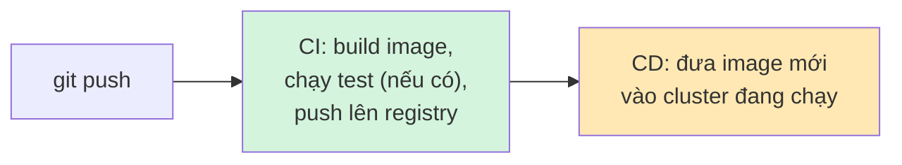
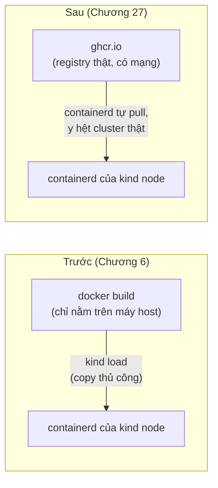

# Chương 27 — Cloud không với tới laptop này: Ghi chú kiến thức

> Đọc truyện trước: [Chương 27 — Cloud không với tới laptop này](../../handbook/vi/part-04-cicd/ch27-the-cloud-cant-reach-this-laptop.md)

---

## 1. Sơ đồ tổng quan: CI dừng ở đâu, CD bắt đầu từ đâu



**Ranh giới quan trọng:** CI (Continuous Integration) chỉ cần một máy có Docker và mạng ra internet — chạy ở đâu cũng được, kể cả máy ảo tạm thời của GitHub. CD (Continuous Deployment) cần một thứ nhiều hơn hẳn: **đường mạng thật** tới đúng cluster cần deploy. Hai việc nghe như một quy trình liền mạch, nhưng đòi hỏi hạ tầng khác hẳn nhau.

---

## 2. GitHub-hosted runner vs self-hosted runner

| | GitHub-hosted | Self-hosted |
|---|---|---|
| Chạy ở đâu | Máy ảo tạm thời của GitHub, huỷ sau mỗi job | Máy do bạn tự quản lý, chạy liên tục |
| Có sẵn gì | Ubuntu/macOS/Windows sạch, cài theo yêu cầu mỗi lần | Y hệt máy đang dùng — `kubectl`, `kind`, mọi thứ đã cấu hình sẵn |
| Truy cập được gì | Chỉ internet công khai | Bất kỳ thứ gì máy đó truy cập được, kể cả mạng nội bộ/localhost |
| Phù hợp việc gì | Build, test, push image — việc không cần biết gì về hạ tầng riêng | Deploy tới cluster private/local, hoặc bất kỳ tài nguyên nào không có địa chỉ công khai |

> **Note:** self-hosted runner không phải "mẹo" hay giải pháp tạm — là cách chính thức GitHub Actions hỗ trợ đúng tình huống "cần chạy job ở nơi có quyền truy cập đặc biệt mà cloud không có". Rất phổ biến trong thực tế cho các cluster on-premise/private, không riêng gì `kind`.

---

## 3. `kubectl set image` — cập nhật một field, không phải `apply` lại cả file

```bash
kubectl set image deployment/chat-api chat-api=ghcr.io/OWNER/REPO/chat-api:SHA -n ai-workspace
```

Lệnh này sửa trực tiếp **một field cụ thể** (`image` của container tên `chat-api`, bên trong Deployment `chat-api`) ngay trên cluster — không cần file YAML nào cả, không phải `kubectl apply -f`. Tương đương một `kubectl patch` viết tắt.

> **Note — cái giá phải trả:** sau lệnh này, `kubectl get deployment chat-api -o yaml` sẽ cho thấy `image` mới, nhưng file `chat-api-deployment.yaml` nằm trong Git **không tự cập nhật theo**. Cluster và file mô tả nó bắt đầu lệch nhau — lần tới có ai `kubectl apply -f chat-api-deployment.yaml` (ví dụ để sửa `resources` hay thêm biến môi trường), image sẽ bị ghi đè ngược lại về giá trị cũ trong file. Đây là giới hạn thật của cách deploy "imperative" này — công cụ như ArgoCD/Flux (GitOps) giải quyết đúng vấn đề này bằng cách bắt Git luôn là nguồn duy nhất, tự động đồng bộ cluster theo Git thay vì để job CI tự ý sửa cluster.

---

## 4. Vì sao `kind load docker-image` không cần nữa



`kind load` chỉ tồn tại để giải quyết vấn đề "image chỉ có trên máy host, không có registry nào để containerd của node tự kéo về". Một khi image đã nằm trên registry thật (GHCR, Docker Hub, hay bất kỳ đâu có mạng), `kind` node hoàn toàn có thể tự `pull` như một cluster thật, không cần bước copy thủ công đó nữa.

---

## 5. Bài tập tự luyện

**Câu hỏi khái niệm:**

1. Nếu tắt máy laptop đang chạy self-hosted runner, rồi push code lên GitHub — chuyện gì xảy ra với job `deploy`? Job đó có tự chạy lại khi bật máy lên không?
2. `GITHUB_TOKEN` dùng để đăng nhập GHCR trong job `build-and-push` — token này có quyền gì, tự sinh ra khi nào, sống được bao lâu?
3. Vì sao tách `build-and-push` và `deploy` thành hai job riêng (`needs: build-and-push`) thay vì gộp chung một job duy nhất có ý nghĩa gì về mặt runner?

**Thực hành:**

4. Đăng ký một self-hosted runner thật (dùng repo riêng để test, không cần đúng repo sách), xác nhận `Listening for Jobs` hiện đúng trên terminal.
5. Push một commit KHÔNG đổi gì trong `project/chat-api/` (ví dụ sửa `README.md`) — xác nhận workflow không chạy, nhờ đúng field `paths` đã khai trong `on.push`.
6. Chạy `kubectl rollout history deployment/chat-api -n ai-workspace` sau vài lần `kubectl set image` — xem lịch sử revision, thử `kubectl rollout undo` về bản trước.
