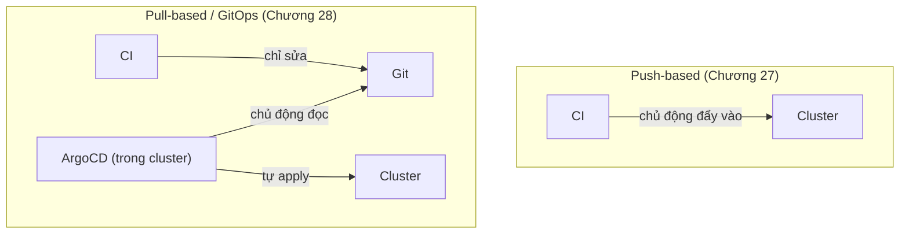
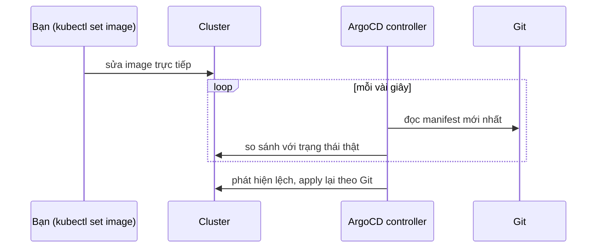

# Chương 28 — Đếm luôn cả YAML: Ghi chú kiến thức

> Đọc truyện trước: [Chương 28 — Đếm luôn cả YAML](../../handbook/vi/part-04-cicd/ch28-counting-the-yaml-too.md)

---

## 1. Sơ đồ tổng quan: GitOps đảo ngược hướng đi của CD



**Khác biệt cốt lõi:** ở mô hình push, cluster là bên **bị động**, ai gửi lệnh vào cũng được — CI, một người gõ `kubectl` tay, bất kỳ ai có quyền. Ở mô hình pull (GitOps), cluster có một tác nhân đứng trong đó, **chủ động** đi đọc Git, không ai "gửi lệnh" vào cluster nữa — tất cả thay đổi đều phải đi qua đúng một cửa: commit vào Git.

---

## 2. `Application` (ArgoCD) — không phải Kubernetes core, là CRD của ArgoCD

```yaml
apiVersion: argoproj.io/v1alpha1
kind: Application
```

`argoproj.io` — API group riêng, không thuộc Kubernetes gốc, y hệt cách `monitoring.coreos.com/PrometheusRule` (Chương 25) không thuộc Kubernetes gốc mà do Prometheus Operator định nghĩa. Cài ArgoCD chính là cài thêm một CRD mới + một controller đọc CRD đó — cùng khuôn mẫu đã gặp nhiều lần: Operator/Controller theo dõi một loại CRD, tự hành động theo nội dung khai trong đó.

| Field | Ý nghĩa |
|---|---|
| `source.repoURL` / `path` | Repo Git nào, thư mục nào chứa manifest cần theo dõi |
| `destination` | Cluster nào, namespace nào để apply vào (có thể khác cluster đang chạy ArgoCD) |
| `syncPolicy.automated` | Có tự sync khi phát hiện lệch không, hay chờ người bấm tay |
| `syncPolicy.automated.selfHeal` | Có tự sửa khi CÓ NGƯỜI sửa tay trực tiếp trên cluster không |

> **Note:** `automated` (tự sync khi Git đổi) và `selfHeal` (tự sửa khi cluster đổi) là **hai cơ chế khác nhau**, dù hay bị nhầm là một. Chỉ bật `automated` mà không bật `selfHeal`, ai đó `kubectl edit` tay vẫn có thể "thắng" tạm thời cho tới lần Git đổi tiếp theo.

---

## 3. Vì sao job `deploy` không cần self-hosted runner nữa

So với Chương 27, `runs-on` của job `deploy` đổi từ `self-hosted` về `ubuntu-latest` bình thường. Lý do: việc job cần làm đã đổi hoàn toàn — từ "gọi `kubectl` vào đúng cluster" (cần đường mạng riêng, cần self-hosted) thành "sửa một file text, `git push`" (chỉ cần mạng internet công khai, GitHub-hosted làm được). Cluster giờ không còn nhận lệnh trực tiếp từ CI — chỉ nhận từ đúng một nơi: ArgoCD, đang chạy sẵn bên trong.

---

## 4. `selfHeal` hoạt động thế nào — không phải phép màu



`ArgoCD` không "chặn" lệnh `kubectl set image` — lệnh đó vẫn chạy thành công, cluster vẫn đổi thật trong khoảnh khắc đó. `selfHeal` chỉ đơn giản là một vòng lặp polling (mặc định vài giây một lần) tự phát hiện sai khác rồi apply lại — đúng nguyên lý reconcile loop đã học từ `kube-controller-manager`, chỉ khác chu kỳ và nguồn so sánh.

---

## 5. Bài tập tự luyện

**Câu hỏi khái niệm:**

1. Nếu Git tạm thời không truy cập được (GitHub sập) trong lúc ArgoCD đang chạy vòng lặp reconcile — cluster hiện tại có bị ảnh hưởng gì không?
2. `selfHeal: true` có nghĩa là không ai được phép `kubectl edit` tay lên cluster nữa sao? Hay vẫn được, chỉ là thay đổi đó không tồn tại lâu?
3. Nếu xoá object `Application` trên ArgoCD — các resource nó từng quản lý (Deployment, Service...) có bị xoá theo không? (gợi ý: tra field `syncPolicy` liên quan tới việc xoá).

**Thực hành:**

4. Cài ArgoCD trên cluster test, tạo một `Application` trỏ vào một repo public bất kỳ có sẵn vài file YAML đơn giản — quan sát trạng thái chuyển từ `OutOfSync` sang `Synced`.
5. Thử tắt `selfHeal` (`selfHeal: false`), sửa tay một resource bằng `kubectl edit` — xác nhận ArgoCD chỉ báo `OutOfSync`, không tự sửa, phải bấm "Sync" tay mới quay lại đúng Git.
6. Xem `kubectl logs -n argocd deployment/argocd-application-controller --tail 50` — tìm dòng log xác nhận đúng chu kỳ polling đang chạy (mặc định thường 3 phút cho lần quét toàn bộ, vài giây cho webhook/thay đổi phát hiện được ngay).
