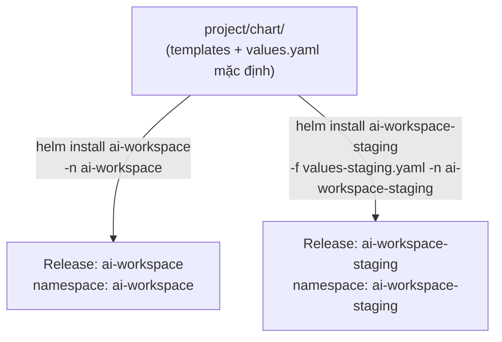
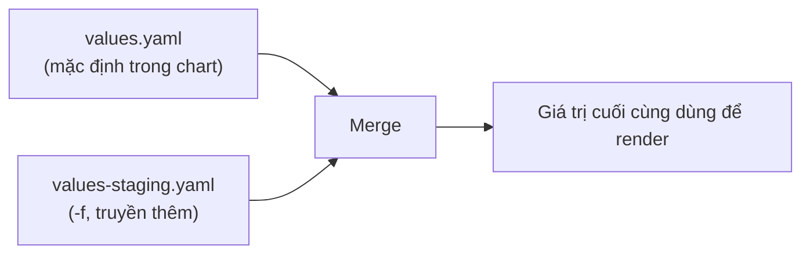

# Chương 29 — Một chart, hai môi trường: Ghi chú kiến thức

> Đọc truyện trước: [Chương 29 — Một chart, hai môi trường](../../handbook/vi/part-04-cicd/ch29-one-chart-two-environments.md)

---

## 1. Sơ đồ tổng quan: một chart, nhiều lần cài, không đụng nhau



**Điểm mấu chốt:** một chart không phải một cluster, một namespace, hay một "bản cài" cố định — nó là một **khuôn**. Mỗi lần `helm install` với tên release và giá trị khác nhau tạo ra một bản hoàn toàn độc lập, không có gì ràng buộc chỉ được cài một lần.

---

## 2. Thứ tự merge giữa nhiều file `values`

```bash
helm install X ./chart -f values-staging.yaml
```



File truyền sau qua `-f` **ghi đè** giá trị tương ứng trong `values.yaml` mặc định, chỉ đúng những field có mặt trong file đó — field nào không nhắc tới thì giữ nguyên giá trị mặc định. Đây là lý do `values-staging.yaml` chỉ cần vài dòng, không phải chép lại toàn bộ.

> **Note:** có thể truyền nhiều `-f` cùng lúc, file sau luôn thắng file trước. Còn `--set key=value` (dùng ở Chương 26 để tắt `grafana.enabled`) thắng tất cả các file `-f`, vì được áp cuối cùng.

---

## 3. `helm template` — xem trước YAML sẽ render ra, không cần apply

```bash
helm template ai-workspace ./project/chart -f project/chart/values-staging.yaml
```

Lệnh này chỉ in ra YAML đã render, không gửi gì lên cluster cả — cách an toàn để kiểm tra template có đúng cú pháp, giá trị có điền đúng chỗ hay không, trước khi thật sự `install`/`upgrade`. Tương đương `kubectl apply -f ... --dry-run=client -o yaml` đã quen từ Chương 12, chỉ khác ở tầng Helm thay vì tầng kubectl.

---

## 4. `helm upgrade` và `helm rollback` — chưa dùng trong chương này, nhưng nối liền mạch

| Lệnh | Việc gì |
|---|---|
| `helm install` | Tạo release mới, thất bại nếu tên đã tồn tại |
| `helm upgrade` | Cập nhật release đã có, theo đúng `values` mới |
| `helm rollback <release> <revision>` | Quay lại đúng bản render trước đó, không cần biết chi tiết đã đổi những gì |

> **Note:** mỗi lần `helm upgrade` tự tăng số `REVISION` (đã thấy ở highnote Chương 24) — đây chính là cơ chế cho phép `rollback` hoạt động, tương tự `kubectl rollout undo` của Deployment (Chương 27), chỉ ở tầng cao hơn: rollback nguyên một bộ manifest, không chỉ một field `image`.

---

## 5. Vì sao Secret vẫn để tĩnh trong template, không đưa vào `values.yaml`

`values.yaml` thường được commit thẳng vào Git, đọc công khai được — đặt giá trị Secret thật vào đó (dù là base64) sẽ lặp lại đúng sai lầm đã sửa ở Chương 12, chỉ chuyển chỗ lộ từ Deployment sang `values.yaml`. Cách làm đúng hơn (không triển khai trong chương này để giữ phạm vi gọn): dùng `helm secrets` (plugin mã hoá giá trị bằng SOPS/age) hoặc để hệ thống bên ngoài (Vault, External Secrets Operator) bơm Secret vào lúc chạy, tách hẳn khỏi chart.

---

## 6. Bài tập tự luyện

**Câu hỏi khái niệm:**

1. `helm install ai-workspace ./chart` (không có `-f`, không có `--set`) dùng giá trị nào? Từ đâu ra?
2. Nếu `values-staging.yaml` khai `chatApi.replicas: 1` nhưng KHÔNG khai `chatApi.resources` — bản staging có `resources` gì?
3. Hai release từ cùng một chart nhưng khác namespace — `helm list` (không kèm `-A` hay `-n`) có thấy cả hai không? Vì sao?

**Thực hành:**

4. Chạy `helm template ai-workspace ./project/chart -f project/chart/values-staging.yaml | grep replicas` — xác nhận đúng `replicas: 1` được render, không phải `3`.
5. Sửa `values.yaml` mặc định, tăng `chatApi.replicas` lên `5`, chạy `helm upgrade ai-workspace ./project/chart -n ai-workspace` — xác nhận bản `ai-workspace-staging` KHÔNG bị ảnh hưởng gì.
6. Chạy `helm history ai-workspace -n ai-workspace` sau vài lần `upgrade` — xem danh sách revision, thử `helm rollback ai-workspace 1 -n ai-workspace` quay về bản đầu tiên.
