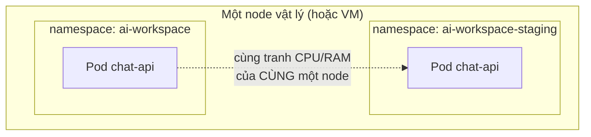
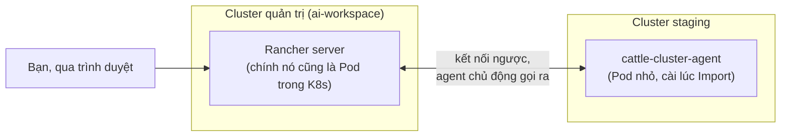

# Chương 30 — Hai cluster, một chỗ nhìn: Ghi chú kiến thức

> Đọc truyện trước: [Chương 30 — Hai cluster, một chỗ nhìn](../../handbook/vi/part-04-cicd/ch30-two-clusters-one-place-to-look.md)

---

## 1. Sơ đồ tổng quan: namespace cách ly gì, không cách ly gì



Đây chính là điều đã học ở Chương 5 (namespace là "ngăn kéo", không phải cách ly vật lý) — giờ mới thấy hệ quả thật: hai namespace không hề tách CPU/RAM của node, chỉ tách tên. Muốn cách ly tài nguyên thật trong CÙNG một cluster, cần `ResourceQuota` (giới hạn tổng tài nguyên một namespace được dùng) — chưa xuất hiện trong sách. Muốn cách ly hẳn ở tầng hạ tầng (một node hỏng không ảnh hưởng cluster kia), cần cluster khác hẳn — đúng hướng chương này đi.

---

## 2. `kubectl config` — nhiều cluster, một file, một context tại một thời điểm

```bash
kubectl config get-contexts
kubectl config use-context kind-ai-workspace
kubectl config current-context
```

`~/.kube/config` có thể chứa thông tin của nhiều cluster cùng lúc (`clusters`), nhiều danh tính đăng nhập (`users`), và nhiều tổ hợp cluster+user+namespace mặc định gọi là `context`. Tại một thời điểm, chỉ đúng MỘT context được đánh dấu `current` — mọi lệnh `kubectl` không kèm `--context` đều áp dụng vào đúng context đó.

> **Note:** đây chính là rủi ro Rancher giải quyết — không phải kubectl "sai", mà con người dễ quên context nào đang active, nhất là khi làm việc với nhiều cluster liên tục trong ngày.

---

## 3. Rancher hoạt động thế nào — không thay thế Kubernetes, đứng cạnh nó



Rancher server tự nó cũng chỉ là một ứng dụng chạy trong Kubernetes (đã cài bằng Helm, y hệt mọi thứ khác). Cluster được "Import" không bị Rancher chiếm quyền kiểm soát — chỉ có thêm một agent nhỏ, tự kết nối ngược về Rancher server để báo cáo trạng thái và nhận lệnh. Xoá Rancher đi, cluster `staging` vẫn hoạt động bình thường, chỉ mất khả năng xem/điều khiển nó từ UI Rancher.

> **Note:** agent kết nối **ngược** (outbound) từ cluster về Rancher, không phải Rancher tự gọi vào cluster — đây là lý do Rancher quản lý được cả cluster nằm sau NAT/firewall, miễn cluster đó gọi ra ngoài được, không cần Rancher có đường vào.

---

## 4. Bài tập tự luyện

**Câu hỏi khái niệm:**

1. Nếu xoá `cattle-cluster-agent` khỏi cluster `staging` (nhưng không xoá gì trên Rancher) — Rancher UI sẽ hiển thị gì về cluster đó?
2. Cluster đóng vai "quản trị" (chạy Rancher server) và cluster "được quản lý" có nhất thiết phải khác nhau không, hay một cluster có thể vừa chạy Rancher vừa tự quản lý chính nó?
3. `ResourceQuota` (nhắc ở mục 1) khác `resources.limits` (đã học ở Chương 14) ở điểm nào — một cái giới hạn cho container, một cái giới hạn cho gì?

**Thực hành:**

4. Chạy `kubectl config get-contexts` trên máy bạn, xác nhận cột `CURRENT` (dấu `*`) đúng với cluster bạn nghĩ đang thao tác.
5. Thử `kubectl --context <tên-context-khác> get pods -n ai-workspace` — xác nhận cú pháp `--context` cho phép thao tác một cluster khác mà không cần đổi context mặc định.
6. Vào Rancher UI, tìm mục hiển thị `cattle-cluster-agent` trong cluster đã Import — xem log của nó (`kubectl logs -n cattle-system deployment/cattle-cluster-agent`), tìm dòng xác nhận kết nối thành công về Rancher server.
