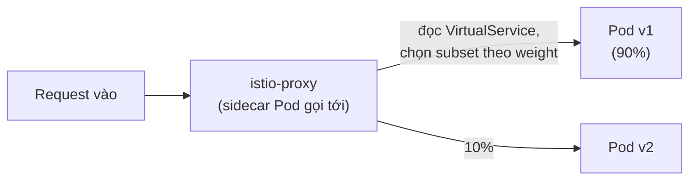
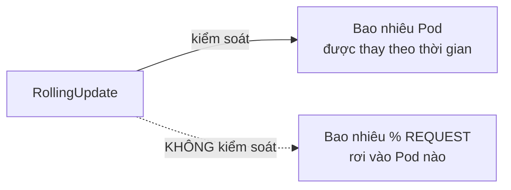

# Chương 31 — Chỉ 10% nhận trước: Ghi chú kiến thức

> Đọc truyện trước: [Chương 31 — Chỉ 10% nhận trước](../../handbook/vi/part-04-cicd/ch31-only-10-percent-get-it-first.md)

---

## 1. Sơ đồ tổng quan: traffic đi qua thêm một lớp, không đổi Service



**Điểm quan trọng:** Service `chat-api` không hề biết gì về `v1`/`v2` — vẫn chỉ lọc theo `app: chat-api` như trước giờ. Việc chia tỉ lệ xảy ra ở lớp Envoy (sidecar), một tầng NẰM TRƯỚC khi request chạm tới Service/Pod thật, hoàn toàn trong suốt với `kubectl get svc`.

---

## 2. Sidecar injection — tự động, không sửa Deployment

```bash
kubectl label namespace ai-workspace istio-injection=enabled
```

Đây chỉ là một **nhãn trên namespace**, không phải cấu hình trên từng Deployment. Một webhook (`MutatingAdmissionWebhook` — cơ chế đã gặp thoáng qua ở Chương 14 khi nói về admission validation, giờ dùng theo hướng khác: không chỉ validate, mà **sửa** object trước khi lưu) chặn mọi request tạo Pod mới trong namespace đó, tự chèn thêm container `istio-proxy` vào `spec.containers`, không cần ai sửa tay YAML gốc.

> **Note:** vì injection chỉ áp dụng lúc Pod được TẠO, Pod cũ (tạo trước khi bật nhãn) không tự có sidecar — cần `kubectl rollout restart` để buộc tạo Pod mới, đúng bước đã làm trong chương.

---

## 3. `DestinationRule` vs `VirtualService` — hai nửa của một luật routing

| | Trả lời câu hỏi gì | Ví dụ trong chương |
|---|---|---|
| `DestinationRule` | "Trong đám Pod của Service X, chia thành những nhóm nào?" | `subsets: v1 (version=v1), v2 (version=v2)` |
| `VirtualService` | "Request tới Service X nên đi vào nhóm nào, theo tỉ lệ bao nhiêu?" | `v1: 90%, v2: 10%` |

`VirtualService` luôn cần `DestinationRule` tương ứng đã tồn tại trước — không thể route tới một `subset` chưa được khai ở đâu cả.

---

## 4. Vì sao không dùng `RollingUpdate` để làm việc này



Trong lúc rolling update, `kube-proxy` route request theo kiểu round-robin/ngẫu nhiên qua TẤT CẢ Pod đang `Ready` tại thời điểm đó — không phân biệt Pod cũ/mới theo đúng nghĩa "10% traffic thật". Muốn kiểm soát chính xác theo phần trăm request, bắt buộc cần một lớp định tuyến L7 hiểu được HTTP (như Envoy), không phải chỉ cân bằng tải L4 mà Service mặc định cung cấp.

---

## 5. Bài tập tự luyện

**Câu hỏi khái niệm:**

1. Nếu xoá `VirtualService` nhưng giữ nguyên cả hai Deployment `v1`/`v2` — request tới `chat-api` sẽ được chia thế nào?
2. `weight: 90` và `weight: 10` có bắt buộc phải cộng đúng 100 không? Thử đoán Istio xử lý ra sao nếu tổng khác 100.
3. Container `istio-proxy` có ăn thêm CPU/RAM không? Việc đó ảnh hưởng gì tới `resources.limits` đã tính cho container `chat-api` từ trước?

**Thực hành:**

4. Chạy `kubectl get pod <tên-pod-chat-api> -n ai-workspace -o jsonpath='{.spec.containers[*].name}'` — xác nhận thấy cả `chat-api` và `istio-proxy`.
5. Đổi `weight` trong `VirtualService` thành `50/50`, `apply` lại, chạy lại vòng lặp `curl` 50 lần — xác nhận tỉ lệ đổi theo đúng kỳ vọng.
6. Thử xoá nhãn `istio-injection=enabled` khỏi namespace, tạo một Pod mới — xác nhận Pod đó KHÔNG có sidecar, chứng minh injection chỉ áp dụng cho Pod tạo sau khi namespace đã được đánh dấu.
