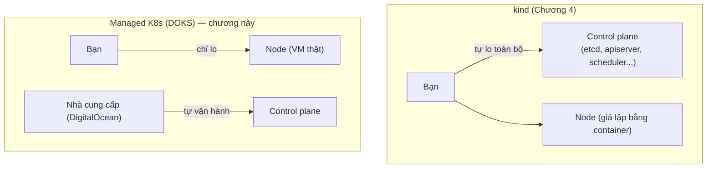
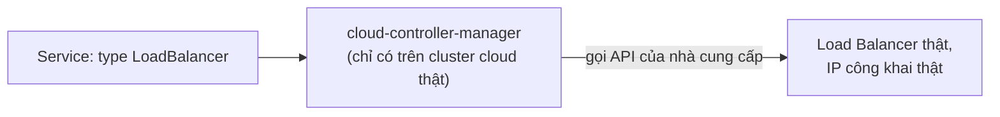

# Chương 32 — Không còn là localhost nữa: Ghi chú kiến thức

> Đọc truyện trước: [Chương 32 — Không còn là localhost nữa](../../handbook/vi/part-04-cicd/ch32-no-longer-just-localhost.md)

Chương này đụng tới hạ tầng cloud thật (DigitalOcean) — không thể tự tay chạy miễn phí như `kind` được. Ghi chú tập trung vào **khái niệm** đứng sau các lệnh, để hiểu đúng bản chất dù chưa có tài khoản cloud để tự tay thử.

---

## 1. Sơ đồ tổng quan: managed Kubernetes bớt việc gì

**Khác biệt cốt lõi:** `kind` mô phỏng TOÀN BỘ cluster (cả control plane lẫn node) bằng container trên một máy. Managed Kubernetes (DOKS, EKS, GKE, AKS...) chỉ giao cho bạn phần node (máy ảo thật, trả tiền theo giờ), còn control plane do nhà cung cấp tự vận hành, vá lỗi, backup `etcd` — đúng phần việc nặng nhất đã học ở Chương 4 giờ không còn là việc của bạn nữa.

---

## 2. Vì sao `Service` kiểu `LoadBalancer` chỉ "thật sự hoạt động" trên cloud

`type: LoadBalancer` đã tồn tại như một khái niệm từ lâu (nhắc qua ở Chương 20 khi so sánh các `Service` type) — nhưng bản thân Kubernetes không tự tạo ra được IP công khai, nó chỉ là một **yêu cầu**. Trên `kind`, không có gì lắng nghe yêu cầu đó, Service sẽ đứng mãi ở `<pending>`. Trên cloud thật, một component gọi là `cloud-controller-manager` (chạy sẵn trong cluster, do nhà cung cấp cài) lắng nghe đúng yêu cầu này, tự gọi API riêng của DigitalOcean/AWS/GCP để tạo một Load Balancer thật, rồi ghi IP đó ngược vào `status.loadBalancer.ingress` của Service.

> **Note:** đây là lý do Chương 21 phải vòng qua `NodePort` + `extraPortMappings` thủ công trên `kind` — không phải vì cách đó "đúng hơn", mà vì `kind` không có `cloud-controller-manager` nào để tự động hoá bước này.

---

## 3. `kubeconfig` với nhiều cluster — không có gì đặc biệt về mặt kỹ thuật

`doctl kubernetes cluster kubeconfig save` chỉ làm đúng một việc: thêm một `cluster` + `user` + `context` mới vào `~/.kube/config`, y hệt cấu trúc đã học ở Chương 30 khi có `kind-ai-workspace` và `kind-ai-workspace-staging`. Cluster thật hay cluster giả lập trên `kind`, với `kubectl`, đều chỉ là một entry trong cùng một file cấu hình — không có API nào phân biệt "cluster thật" khác "cluster giả" cả.

---

## 4. Bài tập tự luyện

**Câu hỏi khái niệm:**

1. Xoá cluster `kind-ai-workspace` trên máy — cluster `do-sgp1-ai-workspace-prod` có bị ảnh hưởng gì không? Vì sao?
2. Chart Helm dùng để deploy lên `kind` và lên DOKS là hoàn toàn giống nhau — điều đó nói lên điều gì về chất lượng của cách viết chart từ đầu?
3. `EXTERNAL-IP` của Service `LoadBalancer` là địa chỉ IP của Node, của Pod, hay của một thứ khác hoàn toàn (Load Balancer do cloud tự tạo)?

**Thực hành (cần tài khoản cloud thật, có phát sinh chi phí):**

4. Nếu có tài khoản DigitalOcean (hoặc bất kỳ cloud nào có Kubernetes managed), thử tạo một cluster nhỏ nhất có thể, deploy một Deployment/Service `LoadBalancer` đơn giản, quan sát `EXTERNAL-IP` chuyển từ `<pending>` sang một IP thật mất bao lâu.
5. Chạy `kubectl get pods -n kube-system` trên cluster cloud đó — so sánh danh sách Pod với `kube-system` của `kind` (Chương 4) — thành phần nào giống, thành phần nào chỉ có trên cloud (ví dụ `cloud-controller-manager`, CNI plugin riêng của nhà cung cấp).
6. Nhớ **xoá cluster** sau khi test xong (`doctl kubernetes cluster delete`) — cluster managed tính phí theo giờ, không tự động dừng như đóng laptop lại được với `kind`.
