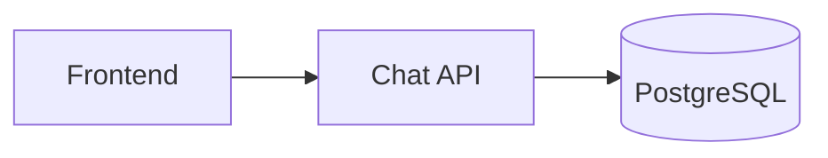
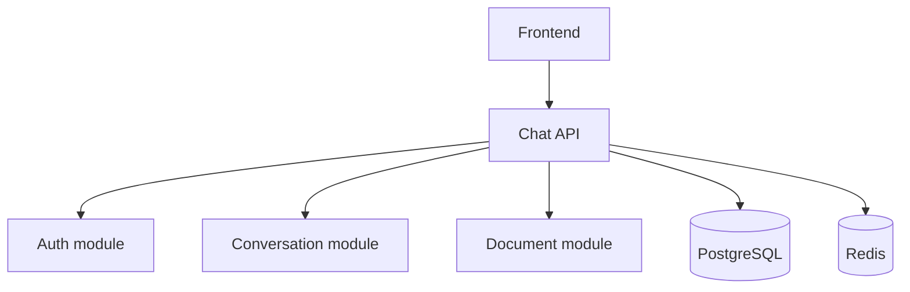
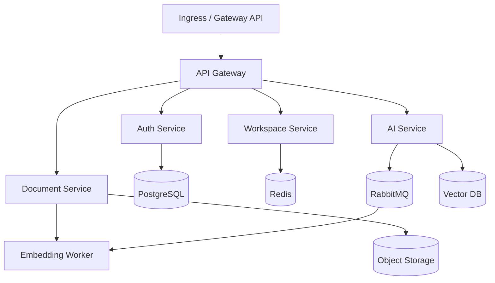

# Kubernetes Odyssey
### *From Docker Compose to Production Platform*

---

## 1. Philosophy

This is not a reference handbook. It's the story of a startup, where Kubernetes is the main character and the project is only the vehicle used to expose problems. "Sprint" is purely **a narrative device** used in prose (e.g. *Chapter 13 — Sprint: Traffic ×20*) to keep the storytelling feel — it is not a separate folder system or numbering scheme.

> **Non-negotiable rule:** at any point in the book, the reader must be able to understand "what the project does" in 5 minutes. If a new business concept shows up, it must come with a clear technical reason immediately — never introduced early "just in case it's needed later."

Four pillars keep the book consistent:

1. **Evolve, don't jump ahead** — the project's architecture moves from monolith → modular monolith → microservices, splitting only when there's a real reason (independent scaling, independent deployment, need for a queue...). No 10 services from day one.
2. **Repetition builds memory** — every new chapter doesn't just teach something new; it makes the reader **redeploy everything learned so far** before adding one more layer. For example, the Service chapter doesn't just teach Service — the reader re-types `kubectl apply` for the Deployment and ConfigMap already covered, then adds Service on top. Typing old commands again across several consecutive chapters is what builds muscle memory, not re-reading theory once.
3. **Learn through incidents, not just instructions** — every major stage includes at least one moment where the system *gets broken* (a Pod deleted by hand, OOMKilled, Ingress Controller removed, a Node going NotReady, losing the cluster...) and the reader has to investigate on their own, with no answer handed to them.
4. **One single source of truth for code** — see section 7. There is never a second place holding the same piece of code that could drift out of sync.

---

## 2. Chapter structure: the first 2–3 chapters are pure theory, then project-heavy

Part I (Chapters 1–3) is pure theoretical foundation — The Big Picture, Docker Review, Why Compose Isn't Enough — no hands-on, no code, just enough vocabulary before diving in. From Chapter 4 onward, every chapter revolves around the project: Mission opens with a real project problem, Theory is just enough to solve it, and Hands-on takes up most of the chapter.

---

## 3. The throughline project: AI Workspace

AI Workspace was chosen (fits the "Odyssey" brand, big enough to cover all 10 Parts) over TaskFlow/BookHub. To avoid breaking the "5-minute understanding" rule, **the domain must reveal itself gradually, matching the architecture's own evolution** — never exposing every component up front.

### Stage 1 — Monolith (Chapters 4–9, Part I–II)



Product: "ask the AI, save the conversation history." No Auth, no Billing. Understandable in 5 minutes.

### Stage 2 — Modular monolith (Chapters 10–18, Part III)



Why it appears: need login (Auth), need session cache/rate-limiting (Redis), need to upload documents to ask the AI about (Document). Still one service, one deployable.

### Stage 3 — Microservices (Chapters 19–34, Part IV–VI)



Why it splits: AI Service needs to scale independently (GPU-bound, high latency), Embedding must run in the background via a queue, Document needs to store large files (Object Storage) and support semantic search (Vector DB). Notification, Billing, and Admin only appear in Part V–VI when a specific situation calls for them (notifications, plan billing).

---

## 4. Which chapters touch code, which don't

Not every theory chapter needs to change the project's code.

| Chapter type | Touches `project/` code? | Example |
|---|---|---|
| Applied directly to AI Workspace | ✅ | Deploy Pod, Service, ConfigMap, HPA, Ingress |
| Foundational theory, standalone lab | ❌ | Linux Network Namespace, etcd/Raft, CNI internals |
| Part X — Under the Hood | ❌ (has its own project: a mini-K8s written in Go) | API Server internals, Scheduler, Kubelet |

---

## 5. Chapter framework — 3 depth tiers

The full 8-section format is only realistic for a small subset of chapters if this is written solo. Split into 3 tiers:

| Section | Tier 1 — Core (~15–18 chapters) | Tier 2 — Standard (most of Part II–IX) | Tier 3 — Deep-read (Part X) |
|---|---|---|---|
| 🎯 Mission (a real project problem) | ✅ | ✅ | ✅ (a mini-K8s problem) |
| 📖 Theory | ✅ | ✅ | ✅ |
| 🛠 Hands-on on AI Workspace (redeploy old + add new, see section 1.2) | ✅ | ✅ | ❌ — hands-on on the separate Go project |
| 🔬 Under the Hood | ✅ | ✅ | ✅ (this *is* the chapter's content) |
| 🧰 Production Notes | ✅ | ⛔ depends on chapter | ⛔ |
| 🐞 Debug Lab (real incident) | ✅ | ⛔ | ⛔ |
| 💬 Interview Questions | ✅ | ⛔ | ⛔ |
| 🚀 Challenge (easy→expert) | ✅ | ✅ (trimmed to 1–2 levels) | ⛔ |

Suggested Tier 1 chapters (following AI Workspace's major milestones): Pod, Deployment, Service, ConfigMap/Secret, Probes, Resource Requests/Limits & OOMKilled, HPA, PVC/StatefulSet (Postgres), Ingress, Prometheus/Grafana, CI/CD pipeline, Helm, GitOps/ArgoCD, RBAC, Backup/Velero.

---

## 6. Roadmap by Part

| Part | Topic | Chapters | Primary tier |
|---|---|---|---|
| I | Foundation (pure theory, see section 2) | 1–3 | — |
| II | First Cluster | 4–9 | Core/Standard |
| III | Making the Project Real | 10–16 | Core/Standard |
| IV | Networking | 17–22 | Standard (17–19 have no code) |
| V | Production (Observability) | 23–28 | Core/Standard |
| VI | CI/CD | 29–34 | Core/Standard |
| VII | Security | 35–39 | Standard |
| VIII | Multi-Cluster & Cloud | 40–46 | Standard (only 1 cloud written in full, the other 2 get a differences note) |
| IX | Platform Engineering | 47–50 | Standard, extended — not mandatory |
| X | Under the Hood | 51–63 | Deep-read — separate mini-K8s (Go) project, decoupled from `project/` |

---

## 7. One source of truth for code

**There is exactly one place where code actually lives: `project/`** — a single AI Workspace repo, evolving commit by commit, with milestones marked by **git tags per chapter** (`ch04`, `ch09`, `ch19`...). To see the project exactly as it stood at a given chapter, just `git checkout ch09`.

Code shown inside a chapter's text **is not a separate file** — it's a direct quote embedded in the prose (a fenced code block), copied verbatim from the corresponding file in `project/` at that chapter's tag, purely to illustrate while reading. Because it lives inside the text itself, there's no physical duplicate to keep in sync — no `handbook/chXX/code/` or any second code tree exists.

```
kubernetes-odyssey/
├── README.md
├── handbook/
│   ├── SUMMARY.md
│   ├── 00-preface/
│   ├── part-01-foundation/
│   │   ├── ch01-big-picture.md
│   │   ├── ch02-docker-review.md
│   │   └── ch03-why-compose-not-enough.md
│   ├── part-02-first-cluster/
│   │   ├── ch04-cluster-architecture.md
│   │   ├── ch06-first-pod.md        # illustrative code lives inside this .md file itself
│   │   └── ...
│   └── part-10-under-the-hood/
│
├── project/                # THE SINGLE SOURCE OF CODE — one repo, tagged per chapter
│
├── labs/chXX/               # step-by-step guides, Tier 1/2 chapters only
├── incidents/chXX/          # only chapters with a Debug Lab (see section 8)
├── challenges/chXX/{easy,medium,hard,expert}.md
├── solutions/chXX/
├── mini-kubernetes/          # separate Go project for Part X
├── diagrams/
├── cheatsheets/
└── scripts/
```

---

## 8. "Break it" — the incident principle

Incidents are only attached to Tier 1 chapters with a Debug Lab, not spread across every chapter (to avoid forcing it). Examples already locked in:

- ReplicaSet chapter: delete a Pod by hand → watch it self-heal.
- Resource Limit chapter: set RAM too low → `OOMKilled`.
- Ingress chapter: delete the Ingress Controller → all traffic breaks.
- Debugging chapter: a Node goes `NotReady` → investigate and recover.
- Backup chapter: simulate losing the entire cluster → recover via Velero.

---

## 9. Reading path

`handbook/` is the book — the primary artifact, meant to be read linearly. Every other folder (`project/`, `labs/`, `incidents/`, `challenges/`, `solutions/`, `mini-kubernetes/`) is a satellite, visited only when a chapter points to it — never a starting point.

- **Single entry point**: the root `README.md` — its only job is to explain how to read the book and point to `handbook/00-preface`.
- **Linear table of contents**: `handbook/SUMMARY.md` (mdBook/GitBook style) lists the exact order from Part I → X, Chapter 1 → 63. It can be built into a PDF/ebook/website straight from this directory tree.
- **Each chapter is self-contained enough to read without leaving the page** — the "🛠 Hands-on" section is a step-by-step guide with code quoted right there on the page, with a note like "full lab at `labs/ch06/`" for anyone who wants to go deeper, and "runnable code: `git checkout ch06` in `project/`" for anyone who wants to run it themselves.
- **There is no separate reading order for project/labs/incidents/...** — they exist only to be referenced by a chapter. Developers who want to jump straight into the code still can (a shortcut), but the main path is always the handbook.

## 10. Open items

- [ ] Full mapping table of all 63 chapters → tier (the summary in section 6 is currently only at the Part level).
- [ ] Detailed content for Chapter 4 (README, docker-compose, sample k8s manifests, `ch04` tag in `project/`) to serve as the template for later chapters.
- [ ] Decision: writing solo or with collaborators — this directly affects how many chapters can reach Tier 1.
