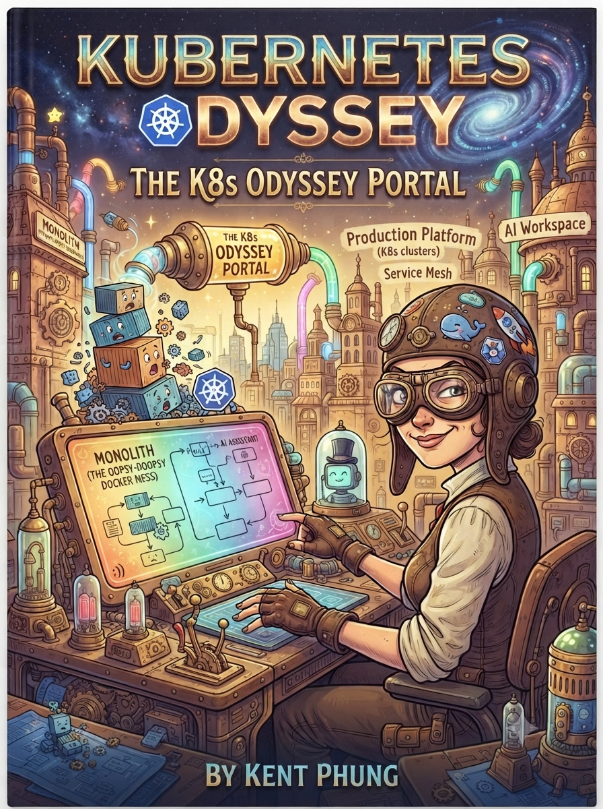
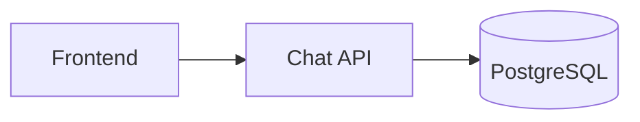
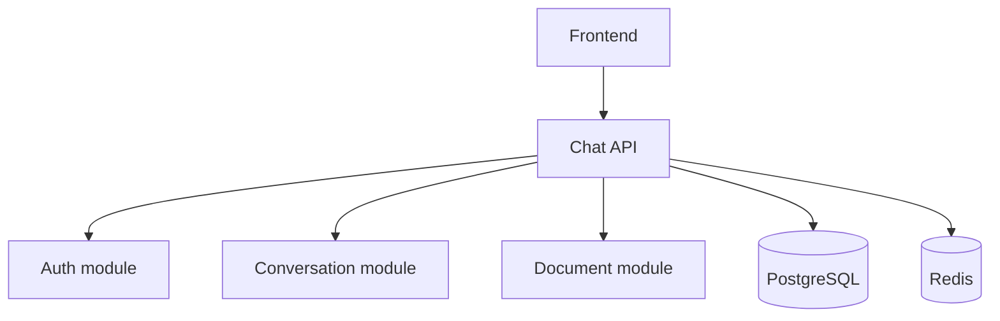
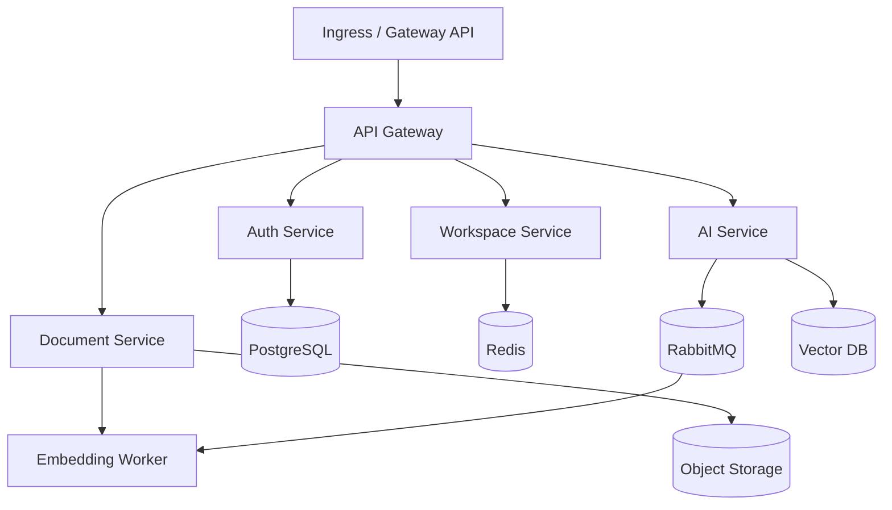

<p align="center">
  
</p>

# Kubernetes Odyssey
### *From Docker Compose to Production Platform*

---

## 1. Philosophy

This is not a reference handbook. It's the story of a startup, where Kubernetes is the main character and the project is only the vehicle used to expose problems. "Sprint" is purely **a narrative device** used in prose (e.g. *Chapter 13 — Sprint: Traffic ×20*) to keep the storytelling feel — it is not a separate folder system or numbering scheme.

> **Non-negotiable rule:** at any point in the book, the reader must be able to understand "what the project does" in 5 minutes. If a new business concept shows up, it must come with a clear technical reason immediately — never introduced early "just in case it's needed later."

Pillars that keep the book consistent:

1. **Evolve, don't jump ahead** — the project's architecture moves from monolith → modular monolith → microservices, splitting only when there's a real reason (independent scaling, independent deployment, need for a queue...). No 10 services from day one.
2. **Repetition builds memory** — every new chapter doesn't just teach something new; the reader **redeploys everything learned so far** before adding one more layer, inside the story itself (typing the same `kubectl apply` commands again as the scene continues, not as a checklist). Typing old commands again across several consecutive chapters is what builds muscle memory, not re-reading theory once.
3. **Learn through incidents, not just instructions** — every major stage includes at least one moment where the system *gets broken* (a Pod deleted by hand, OOMKilled, Ingress Controller removed, a Node going NotReady, losing the cluster...). This happens as a scene in the story — the reader hits the break, investigates, and figures it out — not as a separate labeled exercise.
4. **One single source of truth for code** — see section 6. There is never a second place holding the same piece of code that could drift out of sync.
5. **The reader is the protagonist, always** — never "someone on the team," always "you." Everything in a chapter is something *you* discover, decide, or break, in continuous present-tense stakes, not a ticket description handed to a bystander.
6. **Pure narrative, no scaffolding** — every chapter, hands-on or not, is one continuous scene from first line to last. No section headers (no "Mission," "Theory," "Hands-on," "Debug Lab," "Interview Questions"), no metadata blocks, no tier labels. Code, YAML, and commands are quoted inline exactly where the character actually reads or types them — never pulled out into a separately labeled section.
7. **Knowledge is earned, not front-loaded** — a name, tool, or concept only enters the story once the character has a real reason to go looking for it. If the reader doesn't know Kubernetes exists yet, the word "Kubernetes" does not appear yet either — not even in a diagram. Never define something before the story has made the reader want to know it.
8. **Never break the fourth wall** — no "this book," no "Chapter 3 will...," no "Part IX," no addressing the reader about the book's own structure. If a chapter needs to end on a cliffhanger, end it *in-scene* (the character closes the laptop still without an answer), never with a preview of what's coming.

**Writing craft, concretely:**

- Full sentences. No fragments-for-drama, no elliptical inversions ("Kubernetes, on the other hand, you don't"). If it's hard to parse on first read, rewrite it plainly.
- The character already knows the fundamentals a working engineer would know (Docker, containers, `docker-compose.yml`) before the book starts. Chapter 1 is about learning *this specific project*, not relearning Docker. Investigation is spent on what's genuinely new — first the project, then Kubernetes itself.
- Diagrams are Mermaid, never ASCII box-drawing.
- Code and config examples look real — full YAML with the fields a real file would have (`environment`, `depends_on`, `volumes`...), not a stripped three-line stub.
- **Give the scene room to breathe.** A chapter isn't a technical walkthrough compressed to the minimum word count — it's closer to *The Phoenix Project* or *Designing Data-Intensive Applications*: a specific time and place (a Monday morning, a Friday at 6:43pm), the character's own reaction in the moment ("for a second it feels like a win... then reality catches up"), and a problem that's allowed to build slowly instead of being named immediately.
- **The world has other people in it.** A founder, teammates, customers in a Slack channel — conflict and stakes show up through them (a standup meeting, a dashboard everyone's staring at, a complaint thread), not only through narration at the reader.
- Target roughly 1500–2500 words for an opening-style chapter. Not a hard rule, but a 700-word chapter is a summary, not a scene.
- **Dialogue has to sound spoken, not written.** No clean back-and-forth Q&A where every question is perfectly targeted at what the reader needs next — real conversations interrupt, trail off, and leave things unexplained. A character who conveniently knows everything and explains it all in one tidy call is a plot device; let them be short, busy, or unwilling to give the full lecture, and let the reader piece together the rest elsewhere (their own research, trial and error) instead of being handed it.
- **Texting format:** group a sender's consecutive messages under one name inside a code block, each message on its own `>` line (not repeating the sender's name per bubble); note an attached image as `[image attached]` rather than describing it. **Spoken-call format:** label lines with the speaker's initials/name (e.g. `MT:`, `You:`) instead of unlabeled blockquotes — it reads like an actual call transcript. Real texting is fragmented — a single thought often lands as three or four short sends, not one clean paragraph.

**Narrative symmetry, locked in:** the book opens with *"Clone the repo, run `docker compose up`, you're good to go"* (Chapter 1) and must close — at the end of Part IX, Platform Engineering — with the mirror image: a new engineer joins the now-grown company, and *you* are the one who hands them a single command or URL that makes everything just work, without them ever needing to know what a Pod is. Chapter 1 does not preview this payoff — it should land as a surprise when the reader actually gets there.

---

## 2. The throughline project: AI Workspace

AI Workspace was chosen (fits the "Odyssey" brand, big enough to cover all 10 Parts) over TaskFlow/BookHub. To avoid breaking the "5-minute understanding" rule, **the domain must reveal itself gradually, matching the architecture's own evolution** — never exposing every component up front.

### Stage 1 — Monolith (Chapters 4–9, Part I–II)



Product: "ask the AI, save the conversation history." No Auth, no Billing. Understandable in 5 minutes.

### Stage 2 — Modular monolith (Chapters 10–18, Part III)



Why it appears: need login (Auth), need session cache/rate-limiting (Redis), need to upload documents to ask the AI about (Document). Still one service, one deployable.

### Stage 3 — Microservices (Chapters 19–34, Part IV–VI)



Why it splits: AI Service needs to scale independently (GPU-bound, high latency), Embedding must run in the background via a queue, Document needs to store large files (Object Storage) and support semantic search (Vector DB). Notification, Billing, and Admin only appear in Part V–VI when a specific situation calls for them (notifications, plan billing).

---

## 3. How chapters get written

Chapters are written **one at a time, in order, when we get there** — not pre-scaffolded in bulk. A chapter file is just its title and the story:

```markdown
# Chapter N — Title

[continuous narrative — no metadata block, no section headers]
```

Not every chapter changes `project/`'s code — Part I (Chapters 1–3) is pure story with no hands-on, and a few later chapters (Linux networking fundamentals, internals-heavy topics) are standalone investigation without touching AI Workspace directly. That's decided per chapter as it's written, not pre-labeled with a tier system.

---

## 4. Roadmap by Part

| Part | Topic | Chapters |
|---|---|---|
| I | Foundation | 1–3 |
| II | First Cluster | 4–9 |
| III | Making the Project Real | 10–16 |
| IV | Networking | 17–22 |
| V | Production (Observability) | 23–28 |
| VI | CI/CD | 29–34 |
| VII | Security | 35–39 |
| VIII | Multi-Cluster & Cloud | 40–46 |
| IX | Platform Engineering | 47–50 |
| X | Under the Hood | 51–63 |

Part X (Under the Hood) will get its own separate mini-Kubernetes-in-Go project when we actually reach it — not scaffolded ahead of time.

---

## 5. One source of truth for code

**There is exactly one place where code actually lives: `project/`** — a single AI Workspace repo, evolving commit by commit, kept intentionally simple: just enough to demonstrate that chapter's Kubernetes problem, never real business logic. Each stage (monolith → modular monolith → microservices, per §2) is what actually grows the service count — not narrative flourish.

Milestones are marked by **a git tag per chapter** (`ch04`, `ch09`, `ch19`...), cut as a **GitHub Release** at the same time a chapter is published — roughly the cadence chapters go out (weekly, or every few days). A Release gives readers a browsable page for "this is the code as of Chapter 9," not just a tag they have to know to check out, though `git checkout ch09` still works identically. To see the project exactly as it stood at a given chapter, use either.

Code shown inside a chapter's text **is not a separate file** — it's a direct quote embedded in the prose, copied verbatim from the corresponding file in `project/` at that chapter's tag, purely to illustrate while reading. Because it lives inside the text itself, there's no physical duplicate to keep in sync.

```
kubernetes-odyssey/
├── README.md
├── handbook/
│   ├── en/                  # English edition
│   │   ├── SUMMARY.md
│   │   ├── 00-preface/
│   │   ├── part-01-foundation/
│   │   │   ├── ch01-the-big-picture.md
│   │   │   └── ...
│   │   └── part-10-under-the-hood/
│   │
│   └── vi/                  # Vietnamese edition — same structure, same chapters, its own SUMMARY.md
│       ├── SUMMARY.md
│       ├── 00-preface/
│       └── part-01-foundation/
│           └── ch01-the-big-picture.md
│
├── project/                # THE SINGLE SOURCE OF CODE — one repo, tagged per chapter
├── challenges/              # optional exercises, added per chapter as it's written
├── cheatsheets/             # quick-reference: kubectl commands, YAML snippets
└── diagrams/                # source files for diagrams too complex to inline as Mermaid
```

**Bilingual, maintained in parallel.** `handbook/en/` and `handbook/vi/` are both real, complete editions — not one auto-translated from the other. Mirror the same chapter numbers, file slugs, and Part structure across both, but each language's prose is written and polished on its own terms (dialogue, idiom, and pacing that read naturally in that language, not a literal translation). When a scene, character beat, or structural fix is validated in one language, port it to the other.

---

## 6. Reading path

`handbook/en/` and `handbook/vi/` are the book — the primary artifact, meant to be read linearly, in whichever language the reader picks.

- **Single entry point**: the root `README.md` — its only job is to explain how to read the book and point to `handbook/en/00-preface` (or `handbook/vi/00-preface`).
- **Linear table of contents**: each edition has its own `SUMMARY.md`, updated as each chapter is actually written — never lists a chapter that doesn't exist yet.
- **Every chapter is fully self-contained** — code and commands are quoted right there in the story. Nothing outside `handbook/` needs to be read to follow along.

## 7. Open items

- [ ] Decide what (if anything) replaces structured exercises — `challenges/` still exists, but its format isn't locked in yet.
- [ ] Decision: writing solo or with collaborators.
