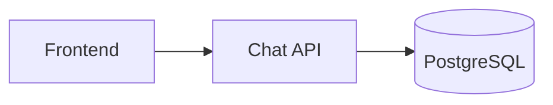

# project/

The single source of truth for **AI Workspace**'s code — the throughline project used across the whole book (see [`outline.md` §2](../outline.md#2-the-throughline-project-ai-workspace)).

The code evolves commit by commit, released as a GitHub Release (and git tag) alongside each chapter — see [`outline.md` §5](../outline.md#5-one-source-of-truth-for-code). Code quoted inside a handbook chapter is copied verbatim from this repo — it is never a separate file that needs to be kept in sync.

## Running it

```
docker compose up --build
```

- `frontend` — http://localhost:3000
- `chat-api` — http://localhost:8080

## Stage 1 (current)



- **`frontend`** — a small React app (Vite, dev server only — no production build yet). Lets you paste in a document and ask a question about it.
- **`chat-api`** — [Hono](https://hono.dev) + [Drizzle ORM](https://orm.drizzle.team) on Node.js. `POST /api/chat` answers a question by naive keyword-overlap against the pasted document text — this is a Kubernetes book, not an AI product, so there's no real LLM call and no API key required. Conversations are stored in Postgres.
- **`postgres`** — official `postgres:16` image, unmodified.

Matches exactly what's shown in Chapter 1 (`handbook/part-01-foundation/ch01-the-big-picture.md` and its Vietnamese equivalent).
